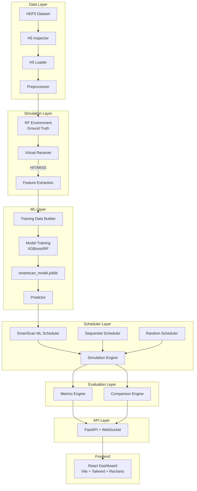
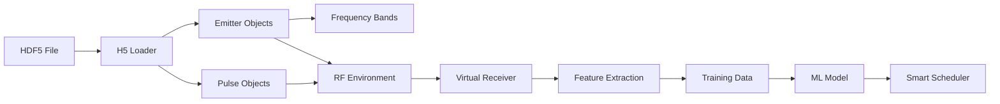

# SmartScan-EW

**ML-Based Electronic Support Receiver Scheduler for Intelligent Frequency Scanning**

> "Instead of blindly sweeping the spectrum, SmartScan learns from previous observations and predicts which frequency-time opportunity is most valuable to observe next."

## Overview

SmartScan-EW is a simulation and data-analysis prototype that demonstrates how an adaptive ML-based scheduler can outperform conventional sequential/open-loop frequency scanning strategies in Electronic Warfare (EW) Electronic Support (ES) scenarios.

This is a **simulated research prototype**, not a real-world EW interception system.

### Key Capabilities
- 🎯 **Reduces average intercept time** vs. sequential scanning
- 📈 **Increases detection rate** through intelligent band selection
- 🧠 **Learns from HIT/MISS observations** using XGBoost/Random Forest
- 🔄 **Handles periodic, frequency-agile, and intermittent emitters**
- 📊 **Real-time dashboard** with explainable ML decisions
- ⚖️ **Fair comparison** against sequential and random baselines

## Architecture



## Dataset

The system is designed around HDF5 radar datasets with this structure:

```
metadata/
  simulation_info  (attrs: version, created_date, description)
  transmitters/
    transmitter_001/
      frequency_config  [center_freq_mhz, bandwidth_mhz]
      pri_config        [pri_us, pri_jitter_pct]
      pulse_width_config [pw_us, pw_jitter_pct]
      position_config   [lat, lon, alt_m]
      power_config      [peak_power_dbm, avg_power_dbm]
      scan_config       [scan_rate, sector_width]
      hop_frequencies   (frequency-agile only)
      duty_cycle        (intermittent only)
observations/
  pulses            Nx7 [time_s, freq_mhz, pw_us, aoa_deg, amplitude_db, emitter_id, snr_db]
  detection_log     Mx4 [time_s, emitter_id, freq_mhz, detected]
scenarios/
  (scenario configuration attributes)
```

A synthetic dataset generator is included for demo purposes.

## Data Pipeline



## Feature Engineering

For each candidate frequency band, features are extracted using **ONLY historical information** (no future data leakage):

| Feature | Description |
|---------|-------------|
| `band_id` | Band identifier |
| `center_frequency` | Normalized center frequency |
| `scan_count` | Total scans of this band |
| `hit_count` / `miss_count` | Detection counts |
| `hit_rate` | Overall hit rate |
| `recent_hit_rate` | Hit rate in last 10 scans |
| `time_since_last_hit` | Seconds since last HIT |
| `time_since_last_scan` | Seconds since last scanned |
| `estimated_pri` | Estimated PRI from timing |
| `pri_variance` | Variance of PRI estimates |
| `periodicity_score` | Autocorrelation-based periodicity |
| `scan_density` | Scan frequency for this band |

## ML Approach

- **Model**: XGBoost (primary), RandomForest (fallback)
- **Target**: `active_next_window` — probability of emitter activity in next time window
- **Training**: Time-based split (70/30) to prevent data leakage
- **Prediction**: P(active | current observations, band, time)

### Priority Score (Explainable)
```
priority_score = 0.50 × ML probability
               + 0.20 × Recent activity
               + 0.15 × Periodicity confidence
               + 0.15 × Exploration bonus
```

### Exploration (ε-greedy)
- 90% exploitation: select highest-priority band
- 10% exploration: select under-explored band
- ε is configurable via the dashboard

## Evaluation Metrics

| Metric | Formula |
|--------|---------|
| Detection Rate | successful detections / total activity windows |
| Interception Rate | successful detections / scanned active windows |
| Average Intercept Time | mean time from emitter activation to first detection |
| False Alarm Rate | false positives / total scans |
| Total Reward | configurable: +10 important, +3 normal, -1 miss, -3 FA |

## Installation

### Prerequisites
- Python 3.10+ (Python 3.13 is supported on Windows)
- Node.js 18+

### Backend Setup
```bash
python -m venv .venv

# Windows
.venv\Scripts\activate
# Linux/Mac
source .venv/bin/activate

pip install -r requirements.txt

cd backend

# Generate sample dataset
python scripts/generate_sample_h5.py

# Train ML model
python ml/train.py

# Start server
uvicorn main:app --host 0.0.0.0 --port 8000
```

### Frontend Setup
```bash
cd frontend
npm install
npm run dev
```

Open **http://localhost:5173** in your browser.

The repository-root `.venv` is used by the Windows commands above. Generated
environments, caches, and trained exports are excluded by `.gitignore`.

### Start Both Services (Windows)

Open two terminals from the repository root:

```powershell
# Terminal 1: API
.\.venv\Scripts\python.exe -m uvicorn main:app --app-dir backend --host 0.0.0.0 --port 8000

# Terminal 2: dashboard
Set-Location frontend
npm run dev
```

## Running the Simulation

1. **Start backend** → loads dataset, generates bands, loads ML model
2. **Open dashboard** → see dataset status, emitters, bands
3. **Click START** → simulation begins stepping
4. **Watch the heatmap** → see SmartScan targeting active frequencies
5. **Run comparison** → see SmartScan vs Sequential vs Random
6. **Try Demo Mode** → auto-run full comparison with results

## API Endpoints

### Contributed AIML Pipeline

The familiar standalone AIML implementation from `mll_code` is integrated at
`backend/ml_pipeline`. It contains the SmartScan dual-head scheduler, DBSCAN
anomaly detector, PDW feature preprocessing, and pulse classifier. The
integration keeps both execution styles working:

```bash
cd backend/ml_pipeline/ml_engine
python test_ml_standalone.py
```

The FastAPI wrapper is available at `/api/ml/pipeline/status` and
`/api/ml/pipeline/predict`. Details about what was synchronized and what was
added by the project are recorded in [backend/ml_pipeline/ML_README.md](backend/ml_pipeline/ML_README.md).

| Method | Path | Description |
|--------|------|-------------|
| GET | `/api/health` | Health check |
| GET | `/api/dataset/structure` | H5 file structure |
| GET | `/api/dataset/summary` | Dataset summary |
| POST | `/api/dataset/load` | Load dataset |
| GET | `/api/bands` | All frequency bands |
| GET | `/api/emitters` | All emitters |
| POST | `/api/simulation/start` | Start simulation |
| POST | `/api/simulation/step` | Single step |
| POST | `/api/simulation/run` | Multiple steps |
| POST | `/api/simulation/reset` | Reset simulation |
| GET | `/api/simulation/state` | Current state |
| GET | `/api/scheduler/ranking` | Band rankings |
| GET | `/api/scheduler/decision` | Last decision with explainability |
| GET | `/api/metrics` | Current metrics |
| GET | `/api/comparison` | Full scheduler comparison |
| POST | `/api/ml/train` | Train ML model |
| GET | `/api/ml/status` | Model status |
| GET | `/api/ml/pipeline/status` | Occupancy/PDW pipeline status |
| POST | `/api/ml/pipeline/predict` | Run occupancy-window and optional PDW inference |
| WS | `/ws/simulation` | Real-time streaming |

## Project Structure

```
smartscan-ew/
├── backend/
│   ├── main.py                  # FastAPI application
│   ├── config.py                # Configuration
│   ├── models.py                # Data models
│   ├── app_state.py             # Global state
│   ├── api/                     # REST API routes
│   │   ├── dataset.py
│   │   ├── simulation.py
│   │   ├── scheduler.py
│   │   ├── metrics.py
│   │   └── websocket.py
│   ├── data/                    # Data layer
│   │   ├── h5_inspector.py
│   │   ├── h5_loader.py
│   │   └── preprocessor.py
│   ├── simulation/              # Simulation core
│   │   ├── environment.py
│   │   ├── receiver.py
│   │   ├── frequency_bands.py
│   │   └── engine.py
│   ├── schedulers/              # Scheduling strategies
│   │   ├── base.py
│   │   ├── sequential_scheduler.py
│   │   ├── random_scheduler.py
│   │   └── ml_scheduler.py
│   ├── ml/                      # SmartScan feature pipeline and scheduler model
│   │   ├── features.py
│   │   ├── build_training_data.py
│   │   ├── train.py
│   │   └── predict.py
│   ├── ml_pipeline/             # Contributed PyTorch and PDW pipeline
│   │   ├── ml_engine/           # Occupancy scheduler and DBSCAN detector
│   │   └── dataset_pipeline/    # Dataset loader and pulse classifier
│   ├── evaluation/              # Metrics & comparison
│   │   ├── metrics.py
│   │   └── comparison.py
│   ├── scripts/                 # Utilities
│   │   ├── generate_sample_h5.py
│   │   └── inspect_h5.py
│   └── models/                  # Trained models
│       └── smartscan_model.joblib
├── frontend/
│   ├── src/
│   │   ├── components/          # 14 React components
│   │   ├── pages/               # Dashboard, DatasetPage
│   │   ├── hooks/               # useSimulation, useWebSocket
│   │   ├── services/            # API client, WebSocket
│   │   └── App.jsx
│   └── package.json
└── README.md
```

## ML Pipeline Integration

The project contains two complementary ML layers under `backend`:

1. `backend/ml/` trains the historical-feature model used directly by the
    simulation `MLScheduler`.
2. `backend/ml_pipeline/ml_engine/` provides the PyTorch dual-head scheduler.
    It accepts a `10 x 50` occupancy matrix and returns dwell-time, next-band,
    and confidence predictions. Optional `N x 4` PDW rows are scaled and
    analyzed with DBSCAN to flag uncatalogued signals.
3. `backend/ml_pipeline/dataset_pipeline/` contains optional gated Hugging
    Face PDW ingestion and pulse classification.

The dashboard Model Status panel reports both the simulation model and the
occupancy pipeline readiness. Train or export contributed models from their
respective pipeline directories; generated model exports and sample CSV data
remain local artifacts.

## Limitations

- Simulation only — no real-world RF transmission
- Simplified emitter behavior models
- Single receiver (no multi-receiver coordination)
- No deep reinforcement learning (architecture supports future addition)
- Feature engineering could be expanded with more temporal patterns

## Future Improvements

- UCB/Thompson Sampling exploration strategies
- PPO reinforcement learning scheduler
- Multi-receiver coordination
- More sophisticated emitter behavior models
- Real-time model retraining
- Export simulation results to file
- Configurable reward functions via UI

## Safety Boundary

This prototype **only simulates**: radar/emitter activity, receiver scanning, detection, prediction, scheduling, and metrics. It does **not** implement any real-world RF transmission, jamming, weapon control, or interference generation.

## License

Hackathon prototype — educational use only.
